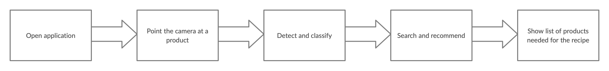
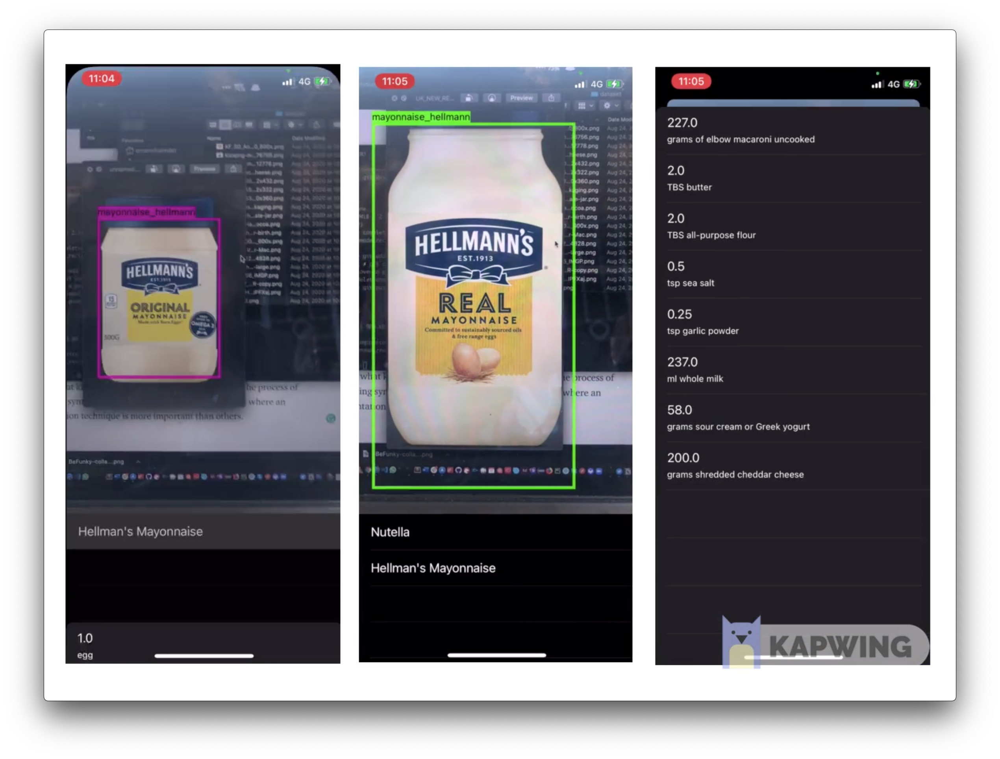
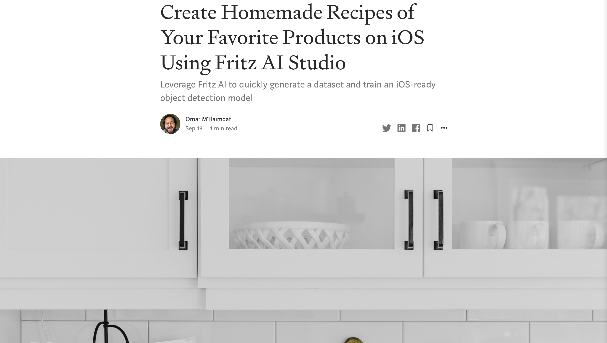

# Create Homemade Recipes of Your Favorite Products on iOS Using Fritz AI Studio
> Leverage Fritz AI to quickly generate a dataset and train an iOS-ready object detection model

## Use case

## Final result

## Requirement
* Xcode 12

## Full tutorial article
**The tutorial is published on Heatbeat:**

## About me

Omar MHAIMDAT – [Linkedin](https://www.linkedin.com/in/omarmhaimdat/) – omarmhaimdat@gmail.com

Distributed under the MIT license. See ``LICENSE`` for more information.

[Look at the rest of my repos](https://github.com/omarmhaimdat/)
